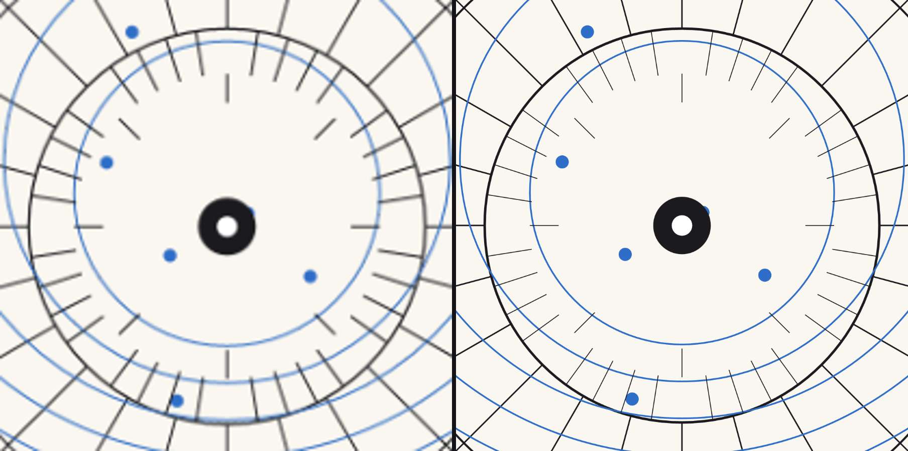
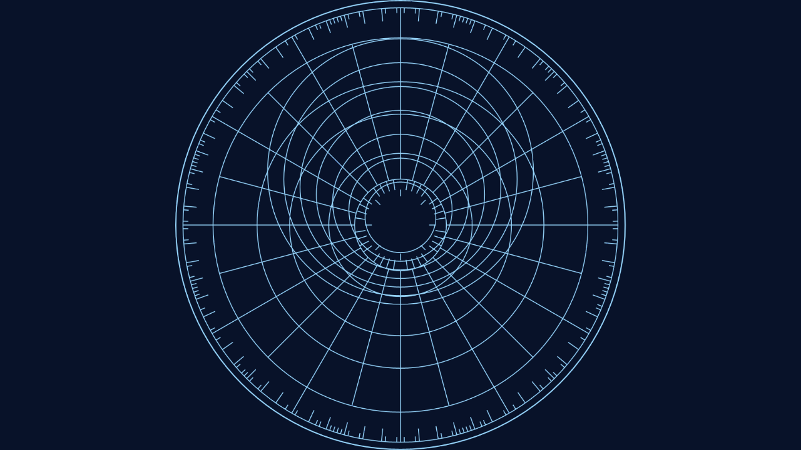

# Burin

> **AI-assisted project.** This codebase was created with [Claude](https://claude.com/claude-code)
> (Anthropic), directed and reviewed by a human author. The central claim —
> that zooming in stays sharp because the drawing is rebuilt at the size it is
> being seen at — is not asserted but **measured**: an offline harness renders a
> hard edge at six zoom levels, measures the width of its transition in device
> pixels, and requires it to stay at one pixel from 1× to 32×. It then repeats
> the measurement against the same code with the rebuild removed, and requires
> *that* to blow up to 25 pixels, so the result is a comparison rather than a
> restatement (see [Status](#status)). Both FFGL plugins **load and render in
> Resolume Arena**, confirmed by the author; the OpenFX build has **not** been
> loaded into Resolve, Nuke or Natron. Check it in your own rig before trusting
> it in a show.

Vector artwork for [Resolume](https://resolume.com) Arena and Avenue, as a pair
of FFGL plugins — and the same thing again as an OpenFX plugin for Resolve,
Nuke, Natron and Vegas. Point it at an SVG and it draws it: at the resolution
the frame actually needs, rebuilt whenever that changes, so going in close stays
sharp instead of turning into a bitmap.

<sub>A *burin* is the engraver's tool — a steel rod cut to a lozenge point,
pushed through copper to raise a line. It is here because the whole argument of
this plugin is that the line stays clean however close you look at it, and
because its write-on does what an engraver does: lays a stroke down along its
own length, one at a time.</sub>



<sub>Both halves are the same drawing at the same 4.3× zoom. **Left:** a
900×900 export, magnified — which is what you get from a PNG, and what the
plugin would be without the thing it is for. **Right:** the plugin, having
re-rasterised at the size being shown. The drawing is
`docs/example-plate.svg`, which ships with the repo and is generated by
`tools/make_example_svg.py`; both frames rendered by `burintest`, the offline
harness.</sub>

**Try it in your browser, with your own SVG:**
[burin.stoatworks-labs.com](https://burin.stoatworks-labs.com) — the plugin's own
scale ladder, reveal timing and style selection in the browser. Nothing is
uploaded.

**Video:** [What it does, in 50 seconds](https://www.youtube.com/watch?v=7LqRVcUemkQ)

<!-- downloads:start -->

## Download

**[v0.1.4](https://github.com/stoatworks-labs/burin/releases/tag/v0.1.4)** — prebuilt for macOS, Windows and Linux. Pick your platform:

<details>
<summary><b>macOS</b> — Universal (Apple Silicon + Intel)</summary>

| Build | Download | Size |
| --- | --- | --- |
| Universal (Apple Silicon + Intel) · .dmg disk image | [`burin-0.1.4-macos-universal.dmg`](https://github.com/stoatworks-labs/burin/releases/download/v0.1.4/burin-0.1.4-macos-universal.dmg) | 638 KB |
| Universal (Apple Silicon + Intel) · .zip archive | [`burin-macos-universal.zip`](https://github.com/stoatworks-labs/burin/releases/latest/download/burin-macos-universal.zip) | 574 KB |
| Universal (Apple Silicon + Intel) · .zip archive (OpenFX — Resolve, Vegas, Nuke) | [`burin-ofx-macos-universal.zip`](https://github.com/stoatworks-labs/burin/releases/latest/download/burin-ofx-macos-universal.zip) | 354 KB |

</details>

<details>
<summary><b>Windows</b> — x64</summary>

| Build | Download | Size |
| --- | --- | --- |
| x64 · .exe installer | [`burin-0.1.4-windows-x86_64-setup.exe`](https://github.com/stoatworks-labs/burin/releases/download/v0.1.4/burin-0.1.4-windows-x86_64-setup.exe) | 274 KB |
| x64 · .zip archive | [`burin-windows-x86_64.zip`](https://github.com/stoatworks-labs/burin/releases/latest/download/burin-windows-x86_64.zip) | 325 KB |
| x64 · .zip archive (OpenFX — Resolve, Vegas, Nuke) | [`burin-ofx-windows-x86_64.zip`](https://github.com/stoatworks-labs/burin/releases/latest/download/burin-ofx-windows-x86_64.zip) | 122 KB |

</details>

<details>
<summary><b>Linux</b> — x64</summary>

| Build | Download | Size |
| --- | --- | --- |
| x64 · .zip archive (OpenFX — Resolve, Vegas, Nuke) | [`burin-ofx-linux-x86_64.zip`](https://github.com/stoatworks-labs/burin/releases/latest/download/burin-ofx-linux-x86_64.zip) | 803 KB |

</details>

All builds, checksums and release notes: [github.com/stoatworks-labs/burin/releases](https://github.com/stoatworks-labs/burin/releases).

macOS builds are signed and notarised and open normally. The Windows builds are unsigned, so SmartScreen warns once.

<!-- downloads:end -->

## What it draws

**SVG.** One format, one parser, no external runtime dependency —
[nanosvg](https://github.com/memononen/nanosvg), vendored, unmodified. Paths,
rectangles, circles, ellipses, lines, polylines and polygons, with flat colours
or linear and radial gradients, strokes with their joins, caps, miters and dash
patterns, and grouped transforms.

**What it does not draw, and this is the one to read before you file a bug:**

> **Live `<text>` is not rendered — at all.** nanosvg has no text support
> whatever: no font loading, no glyph outlines, not even a stub. An SVG whose
> content is live text parses without error and draws an empty frame.
> **Convert text to outlines before exporting.** In Illustrator that is Type →
> Create Outlines; in Inkscape, Path → Object to Path; in Figma, Outline
> Stroke/Flatten; in Affinity Designer, Layer → Convert to Curves.

Also ignored: `<use>`, `<image>`, `<clipPath>`, `<mask>`, `<pattern>` and
`<filter>`. The plugin **counts** all of these while loading and says so in its
log and in `burintest --doc`, because "the plugin does nothing" and "your file is
mostly live text" are otherwise the same picture.

`.svgz` is deliberately not offered: it is gzipped SVG, nanosvg has no inflate,
and a picker that accepted it would take a file the plugin then failed to parse.

## The idea

A bitmap zoomed eight times is eight times blurrier. A vector zoomed eight times
is not — but only if something re-rasterises it, and re-rasterising a
thousand-path drawing every frame is not a budget a show has.

So the scale is snapped onto a ladder of half-octave rungs, and the drawing is
rebuilt only when the rung changes. Between rebuilds the GPU scales what is
already there, and it never has to cover more than half an octave. **The ladder
always rounds up**, so the raster is always at least as fine as the screen needs
and the hardware only ever shrinks it — which costs sharpness nothing, where
enlarging by even 19% is plainly visible on a hard edge.

Two things follow that matter in use:

- **The raster covers what is on screen, not the whole document.** Zooming from
  1× to 50× does not grow it. A small mark in the corner of a large artboard
  costs the size of the mark.
- **A still frame never rebuilds, and a pan mostly does not.** A six-octave zoom
  rebuilds thirteen times across six hundred frames; three hundred frames of pan
  cost four rebuilds.

## Two plugins

**Burin** is a source: the drawing on its own background, on its own layer.

**Burin Over** is an effect: the same drawing over the incoming clip, with a
Mix control. It exists because the obvious way to get a logo over footage — put
the source on its own layer and pick a blend mode — costs a layer and puts the
drawing's controls somewhere other than the clip they belong to.

There is deliberately **no "use the incoming clip as the drawing"** mode. A clip
is a raster; the whole point here is that the source is not one.

## Controls

**Document** — the file, whether it is framed by its declared artboard
(**Viewport**) or by its ink (**Content**), how it is fitted, and **Detail**: how
fine the raster is relative to the frame. Above 1× it is rasterised finer and
downsampled, which beats nanosvg's own antialiasing on thin diagonals; below 1×
it is the release valve on a heavy drawing.

**Style** — **Draw** picks fills, strokes or both. This is exact, not
approximated: nanosvg keeps the two as separate paint on the same shape and
tests each independently, so *Stroke Only* on artwork that was only ever composed
as solids gives you the wireframe of something whose author never drew one.
**Stroke Width** scales what the file declared; **Min Stroke px** holds a floor
in device pixels, which matters more than it sounds — nanosvg drops a stroke
entirely below a hundredth of a pixel, so hairlines on a drawing being zoomed out
vanish one shape at a time rather than fading. **Recolour** replaces fill,
stroke or both while keeping each shape's own alpha, and **Colour Spread** walks
the hue across the shapes.

**Isolate** — a first shape and a count. Real integers, because they are counting
your file.

**Reveal** — the write-on. **Draw On** draws strokes in along their own length;
**Retract** takes them back toward where the pen started; **Hold** puts the
Progress slider in charge so a reveal can be keyframed or cued by hand.
**Stagger** offsets each shape against the next, and **Order** decides the
sequence — document order, reversed, longest first, shortest first, or a stable
scatter. **Fill Fade** brings each shape's fill up behind its own line.

**Motion** — Zoom, Position, Rotate, and an excursion for each: **Zoom Move**,
**Drift X/Y**, **Spin**. They share one clock, which runs free, per beat, per bar
or off the **Phase** slider, and one **Wave**. The two drift axes are a quarter
cycle apart, so a drawing with both set wanders rather than sliding on a
diagonal.

**Colour** — tint, opacity, a background, and Mix on the effect build.

**Preset** — eight named looks. A preset never touches your file, the Bounds
control, or the Isolate range: those describe your material, not a look.



<sub>*Blueprint* with the write-on part way through, ordered longest-first — so
the structure arrives before the detail.</sub>

## Trying it

```
cmake -B build -DCMAKE_BUILD_TYPE=Release
cmake --build build
cmake --install build          # into ~/Documents/Resolume Arena/Extra Effects
```

Then in Resolume: **Sources → Generators → Burin**, or drop **Burin
Over** on a clip. Point *Drawing* at `docs/example-plate.svg` to start with
something.

## OpenFX — Resolve, Vegas, Nuke, Natron

Both plugins ship again as one OFX bundle, CPU-rendered. Copy
`build/Burin.ofx.bundle` into `/Library/OFX/Plugins`.

Unusually for this kind of port, almost nothing is reimplemented: the picture is
built by a CPU rasteriser in **both** builds — in Resolume the GPU only does the
final transform and composite — so the document, the styling, the reveal, the
motion, the scale ladder and even the reading of the controls are the same code,
linked from the same source files. A preset is the same look in Resolve as in
Resolume because both read one table through one interpreter, not because two
implementations were kept in step.

Sync offers Free and Manual only: an OFX host carries no tempo. Manual is the
mode for keyframing Phase against the edit.

## Build

- CMake ≥ 3.15, a C++17 compiler.
- `git submodule update --init --recursive` for the FFGL SDK.
- macOS builds universal (arm64 + x86_64) by default; add
  `-DCMAKE_OSX_ARCHITECTURES=arm64` for a faster development build.
- Windows needs GLEW, which arrives through `vcpkg.json`.
- `-DBUILD_OFX=OFF` skips the OpenFX target.

## Status

**Runs in Resolume Arena. The OpenFX build has not been loaded into a host.**

Both FFGL plugins load and render in Arena — confirmed by the author after
release. That is "it loads and it draws"; it is not a sweep of every control in
a live host, and the open questions further down are still open. The OpenFX
bundle builds, exports `OfxGetPlugin` and passes the release-time signing
checks, but has not been opened in Resolve, Nuke or Natron.

Everything else below is measured offline. `tools/verify.sh` runs it, including
the two traps that otherwise only surface in a release job after a tag. What the
measurements actually establish:

- **Sharpness across zoom**, with its own control. A hard edge measures 1.0 px of
  alpha transition at 1×, 2×, 4×, 8×, 16× and 32×. The same raster left
  un-rebuilt measures 1, 3, 3, 7, 13 and 25 px across the same range.
- **The ladder never rounds down**, checked across four thousand scales rather
  than a handful — and 1.0, 2.0 and 0.25 stay exactly on their rungs, so an
  un-zoomed drawing does not silently cost twice the pixels.
- **Rebuilds are rare**: 13 across a six-octave zoom in 600 frames, 4 across 300
  frames of pan, 0 on a still frame.
- **Fill and stroke separate exactly**: a shape with no fill renders nothing
  under *Fill Only* and keeps its stroke under *Stroke Only*.
- **The write-on tracks its parameter** to within measurement precision at every
  tenth, never goes backwards, draws nothing at 0, and at 1 is the *same frame*
  as no reveal at all.
- **The GPU and CPU renderers agree bit-exactly** — worst-case difference 0 of
  255 levels — which is what keeps Resolume and Resolve honest against each
  other.
- **Every factory preset draws**, applied through the real dropdown and sampled
  across its own cycle.
- **No dead controls**: 37 parameters swept end to end, 5 excluded with reasons.

Costs, measured on the 464-shape example drawing with the write-on running, which
is the worst case because its pixels change every frame:

| frame | rasterise | composite |
|---|---|---|
| 1280×720 | 8.0 ms | 5.9 ms |
| 1920×1080 | 13.6 ms | 12.1 ms |
| 3840×2160 | 44.6 ms | 48.1 ms |

Only the rasterise column is paid in Resolume — the composite is a shader there —
and only on a **rebuild**. Detail below 1× is the lever if a heavy drawing costs
too much at 4K.

Still open even in Arena, because loading and drawing does not answer them:
whether Resolume renders the two integer parameters as typed spinners or falls
back to 0..1 sliders, whether the file picker behaves with a path that no longer
resolves (the plugin keeps the previous drawing on screen rather than blanking,
and says so only in the log), and whether the twice-an-octave rebuild during a
continuous zoom is visible in a room.

## Diagnostics

Both builds write one log. No crash handler — this runs inside somebody else's
process — and no bundle command.

    ~/Library/Logs/burin/burin.YYYY-MM-DD.log

It covers the failures that all look identical from outside: a file that would
not open or parse, a file that parsed and contains nothing this renderer can draw
(the important one — live text), a raster capped for size, and a shader that
would not compile.

<!-- attributions:start -->
This project is built on other people's work — see [ATTRIBUTIONS.md](ATTRIBUTIONS.md).
<!-- attributions:end -->

## Licence

MIT. See [LICENCE](LICENSE) and [ATTRIBUTIONS.md](ATTRIBUTIONS.md).

`docs/example-plate.svg` is original work generated by
`tools/make_example_svg.py`, MIT with the rest of the repo.
